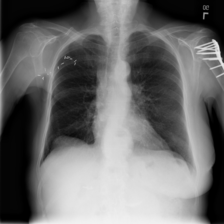

# mm-cxr-diag

A two-stage multimodal classifier for NIH ChestX-ray14. The system pairs
clinical tabular features (age, gender, view position, follow-up) with
the image and routes every study through an **abnormality gate** before
reaching a 14-way **pathology classifier** — with the goal of lifting F1
on rare pathologies (Hernia, Pneumonia, Fibrosis) where a single-stage
model is crushed by the "No Finding" prior.

- Five selectable backbones: `densenet121`, `densenet201`, `vit_b_16`,
  `vit_b_32`, `vit_l_16` — all with a multimodal-concat classifier head.
- Two-stage inference combines probabilities multiplicatively:
  `P(pathology_i) = sigmoid(s1) * sigmoid(s2_i)`. No hard gating — that
  would discard rare-class recall on borderline studies.
- Ships as a pip-installable package, a Typer CLI, a FastAPI service,
  and a Docker image.

## Architecture at a glance

```
                ┌─────────────────────┐
  image ───────▶│  Stage 1 (binary)   │──▶ P(abnormal)
  tabular ─────▶│  abnormality gate   │
                └─────────────────────┘
                          │
                          ▼
                ┌─────────────────────┐
  image ───────▶│  Stage 2 (14-way)   │──▶ P(pathology | abnormal)
  tabular ─────▶│  pathology head     │
                └─────────────────────┘
                          │
                          ▼
              P(pathology_i) = P(abnormal) × P(pathology_i | abnormal)
              P(No Finding)  = 1 − P(abnormal)
```

The two stages are **independent models** — separate checkpoints,
separately trainable, separately deployable. Stage 2 is trained only on
abnormal studies, which changes the class-base-rate distribution Stage 2
sees (Infiltration ~9% → ~20% of abnormal studies; Hernia ~0.2% →
~0.5%). The training pipeline recomputes focal-loss class weights from
the abnormal-only subset when focal loss is enabled.

## Install

Torch is intentionally **not** pinned to a specific CUDA build in the
package metadata. Install torch first from the appropriate PyTorch index,
then the package:

```bash
# GPU
pip install --index-url https://download.pytorch.org/whl/cu121 \
  "torch>=2.3,<3" "torchvision>=0.18,<1"
pip install "mm-cxr-diag[serve] @ git+https://github.com/geekmdtravis/mm-cxr-diag"

# CPU
pip install --index-url https://download.pytorch.org/whl/cpu \
  "torch>=2.3,<3" "torchvision>=0.18,<1"
pip install "mm-cxr-diag @ git+https://github.com/geekmdtravis/mm-cxr-diag"
```

For development:

```bash
git clone https://github.com/geekmdtravis/mm-cxr-diag
cd mm-cxr-diag
pip install -e ".[dev,serve]"
pre-commit install
```

## CLI

```bash
mm-cxr-diag --help
```

Five subcommands:

| Command        | Purpose                                                  |
| -------------- | -------------------------------------------------------- |
| `prepare-data` | Split raw NIH metadata CSV into preprocessed train/val/test splits. |
| `train`        | Train a Stage 1 or Stage 2 model on preprocessed splits. |
| `evaluate`     | Evaluate a checkpoint (or a two-stage pair) on a test split. |
| `predict`      | Run the full hierarchy on a single image.                |
| `serve`        | Start the FastAPI inference service.                     |

### Typical end-to-end workflow

```bash
# 1. Split the raw NIH metadata. Expects images to already be available
#    somewhere on disk (download via kagglehub or the NIH portal).
mm-cxr-diag prepare-data \
  --input-csv path/to/Data_Entry_2017.csv \
  --images-dir path/to/images_all \
  --output-dir artifacts/splits \
  --val-size 0.1 --test-size 0.2

# 2. Train Stage 1 (abnormality gate). BCE is fine — the split is
#    roughly balanced.
mm-cxr-diag train \
  --config configs/stage1/densenet121.yaml \
  --train-csv artifacts/splits/train.csv \
  --val-csv   artifacts/splits/val.csv \
  --images-dir path/to/images_all \
  --output-dir results/runs \
  --epochs 30 --lr 1e-4 --batch-size 64

# 3. Train Stage 2 (pathology classifier). Focal loss recommended;
#    class weights are recomputed on the abnormal-only subset of the
#    training CSV automatically.
mm-cxr-diag train \
  --config configs/stage2/densenet201.yaml \
  --train-csv artifacts/splits/train.csv \
  --val-csv   artifacts/splits/val.csv \
  --images-dir path/to/images_all \
  --output-dir results/runs \
  --epochs 50 --lr 1e-4 --batch-size 32 \
  --focal-loss

# 4. Evaluate the two-stage pipeline end-to-end.
mm-cxr-diag evaluate --stage both \
  --stage1-ckpt results/runs/stage1/densenet121/<run>/best_model.pth \
  --stage2-ckpt results/runs/stage2/densenet201/<run>/best_model.pth \
  --test-csv artifacts/splits/test.csv \
  --images-dir path/to/images_all

# 5. Single-image prediction.
mm-cxr-diag predict \
  --stage1-ckpt ...best_model.pth \
  --stage2-ckpt ...best_model.pth \
  --image study.png \
  --tabular-json '{"patientAge":0.6,"patientGender":1,
                   "viewPosition":0,"followUpNumber":0.1}' \
  --output table
```

Tabular inputs must be pre-normalized to match the training distribution:
age and follow-up scaled to `[0, 1]`, gender `0=M / 1=F`, view position
`0=PA / 1=AP`. The order is defined in `mm_cxr_diag.inference.transforms.TABULAR_FEATURE_ORDER`.

## REST API

```bash
mm-cxr-diag serve \
  --stage1-ckpt /path/to/stage1.pth \
  --stage2-ckpt /path/to/stage2.pth \
  --host 0.0.0.0 --port 8000
```

Checkpoint paths can be supplied via `MM_CXR_STAGE1_CKPT` /
`MM_CXR_STAGE2_CKPT` env vars instead of CLI flags (preferred for
containerized deployment).

Endpoints:

| Method | Path              | Purpose                                       |
| ------ | ----------------- | --------------------------------------------- |
| POST   | `/predict`        | Full hierarchical prediction.                 |
| POST   | `/predict/stage1` | Abnormality gate only.                        |
| POST   | `/predict/stage2` | Raw `P(pathology \| abnormal)`; for debugging. |
| GET    | `/health`         | Liveness + `{stage1_loaded, stage2_loaded}`.  |
| GET    | `/version`        | Package and loaded-model identity.            |

Example:

```bash
curl -s -X POST http://localhost:8000/predict \
  -F image=@study.png \
  -F 'tabular={"patientAge":0.6,"patientGender":1,"viewPosition":0,"followUpNumber":0.1}' \
  | jq .
```

Auto-generated OpenAPI docs are at `/docs` (Swagger UI) and `/redoc`.

## Docker

```bash
docker build -t mm-cxr-diag:latest .

docker run --rm -p 8000:8000 \
  -v "$(pwd)/checkpoints:/ckpts:ro" \
  -e MM_CXR_STAGE1_CKPT=/ckpts/stage1.pth \
  -e MM_CXR_STAGE2_CKPT=/ckpts/stage2.pth \
  mm-cxr-diag:latest
```

The image is built on `pytorch/pytorch:2.3.1-cuda12.1-cudnn8-runtime`
(CUDA 12.1 with cuDNN; falls back to CPU if no GPU is available),
multi-stage with a non-root `app` user, and HEALTHCHECKs `/health` every
30s. Checkpoints are mounted at runtime — not baked into the image —
so you can swap models without a rebuild.

Published images land at `ghcr.io/<owner>/mm-cxr-diag` on `v*` tag push.

## Package layout

```
mm_cxr_diag/
├── config/            RuntimeSettings (pydantic-settings, no side effects)
├── data/              ChestXrayDataset, dataloaders, label utilities
├── losses/            Focal loss with effective-number-of-samples reweighting
├── models/
│   ├── registry.py    @register / build_model factory
│   ├── fusion.py      Shared multimodal concat-MLP head builder
│   ├── cxr_model.py   CXRModel + CXRModelConfig
│   └── backbones/     {densenet,vit}.py — 5 backbones, all multimodal-concat
├── training/          train_model, evaluate_model, run_inference
├── inference/
│   ├── predictor.py   SingleStagePredictor
│   ├── hierarchical.py HierarchicalPredictor + HierarchicalPrediction
│   ├── transforms.py  Single-image preprocess + tabular adapters
│   └── persistence.py save_model / load_model
├── service/           FastAPI app, routes, schemas
├── cli/               Typer app + subcommand modules
└── utils/             Logging (no import-time side effects)

configs/stage{1,2}/<backbone>.yaml   CXRModelConfig templates
tests/{unit,integration,service,cli} Tests (pytest)
```

## Development

```bash
# Tests (fast suite, CI gate at 65% coverage)
pytest -m "not slow and not real_data"

# Full suite including per-backbone trainer smoke tests
pytest

# Lint / format
ruff check mm_cxr_diag tests
ruff format --check mm_cxr_diag tests
black --check mm_cxr_diag tests
```

CI runs fast tests on every push/PR and the slow suite (per-backbone
trainer smoke) nightly at 06:00 UTC. The slow suite materializes five
ImageNet-pretrained weight archives and validates that the full
dataloader → model → loss → optimizer → checkpoint → reload pipeline
works for each of the five backbones at both Stage 1 and Stage 2 output
shapes.

## Provenance and motivation

This project began as a CS7643 course study showing that fusing four
clinical tabular features with image features produced a small but
statistically meaningful lift over image-only classifiers on NIH
ChestX-ray14 (weighted AUC `0.7295 ± 0.0097` vs `0.7275 ± 0.0092`,
p = 0.0001). Rare pathologies, however, had dismal F1 — Hernia ~0.04,
Pneumonia ~0.06, Fibrosis ~0.08 — because a single multi-label head has
to simultaneously decide *whether anything is there* and *what it is*,
and the overwhelming "No Finding" prior dominates training.

The two-stage hierarchy is the response. Stage 1 absorbs the normal/abnormal
imbalance once, at a stage with abundant signal, so Stage 2 can specialize
on pathology discrimination with a rebalanced class distribution.



## Acknowledgements

The original CS7643 course project this codebase descends from was a
collaboration between:

- [Travis Nesbit, MD](https://github.com/geekmdtravis)
- [Emad Albalas](https://github.com/ealbalas)
- Anonymous Classmate (respecting their preference)
- [Shardul Dhande](https://github.com/sharduldhande)

The single-stage multimodal classifier, the focal-loss reweighting, and
the statistical comparison framework all originated in that joint work.
The two-stage hierarchical redesign, packaging, CLI, and FastAPI service
are subsequent work on this fork.

## License

MIT. See `pyproject.toml`.
